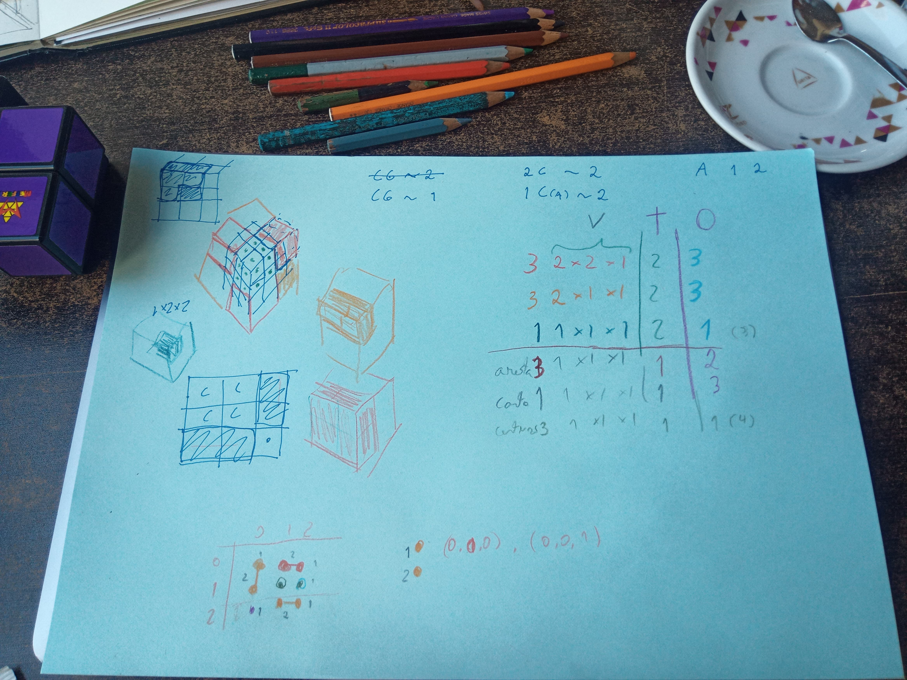
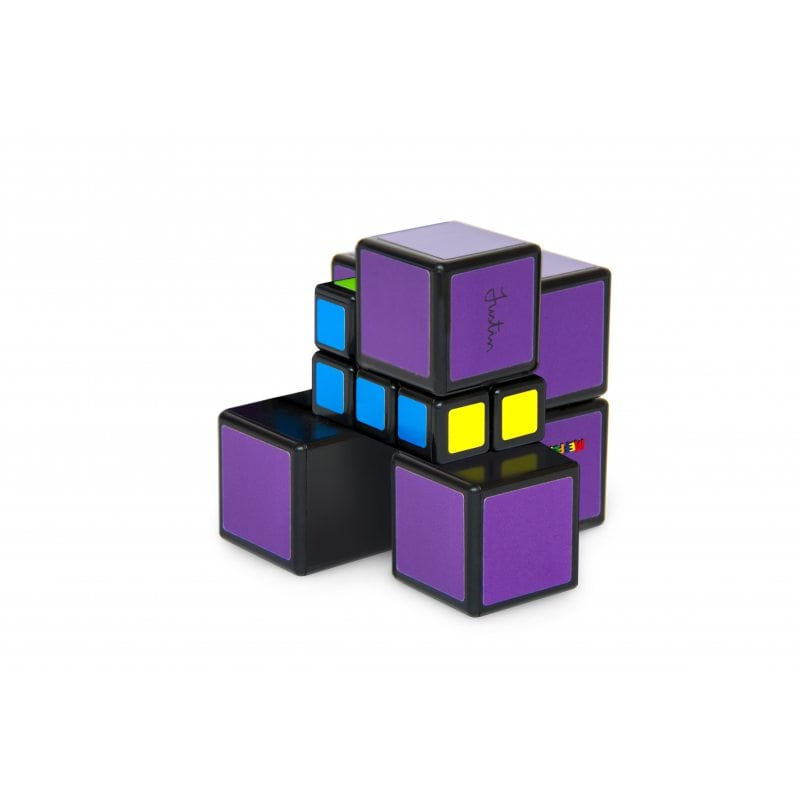
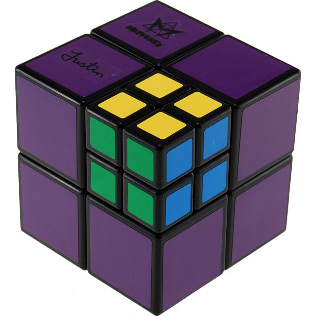

# pocket-cube-solver
This is an attempt to solve Pocket Cube from Justin with Haskell.

I haven't used any advanced techniques to solve it. First, I've defined a model and the transitions relation, and then just try all the possible paths until you arrive at the solved state.

I only assumed this was a good strategy because the number of possible states is much smaller than a normal 3x3x3.

I was able to map this cube to a 3x3x3, the logic being that some cubes are merged together and extended to make it appear off-centered.

In a traditional Rubik's cube, there are 2 types of pieces: edges and corners. In this one I was able to identify edged, corner, and 3 more piece types.
I name them after the colors used in my first sketch diagram:

### Random things I learned in Haskell:
1. Appending elements to the end of a list is really slow. Lists are linked lists in Haskell. If I have a sequence of 30 moves and want to add a new move to this list, I have to skip over the 30 moves to do so. Instead, I tried adding moves to the beginning of a list, with far greater success.
  - I did not use `Sequence` for storing moves, the reason was pure laziness, as I don't see a large gain in doing so.

2. Sequences from [`Data.Sequence` ](https://hackage-content.haskell.org/package/containers-0.8/docs/Data-Sequence.html) are much faster than lists. Sequences are finite lists, in practice, they are a very interesting structure: [FingerTrees](https://www.staff.city.ac.uk/~ross/papers/FingerTree.html). Similarly to other trees, it's very cheap to insert, remove, and concatenate. I used it for queuing the cube states I wanted to explore next.
  - I left my slow version of `bfs` in there for comparing, it also redoes a lot of unnecessary cube neighbor computing.

4. [foldl vs foldl' vs foldr](https://wiki.haskell.org/Foldr_Foldl_Foldl%27) - the practical efficiency differences of folds are very interesting. It
   explains how sometimes stack overflows can appear in foldl and how it can be solved with strict evaluation.

